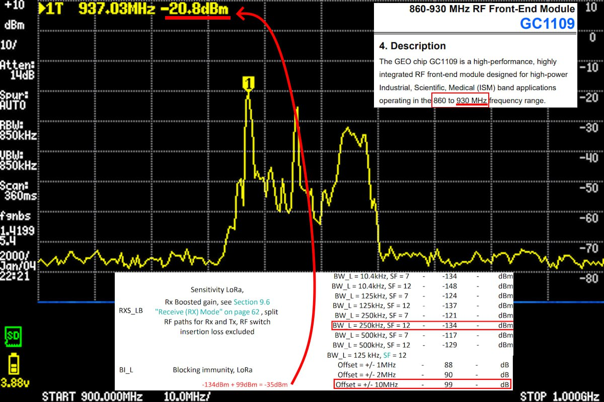
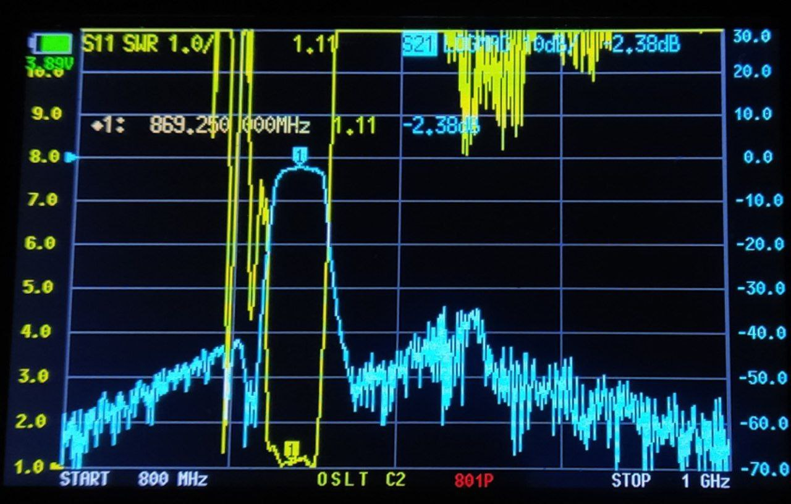
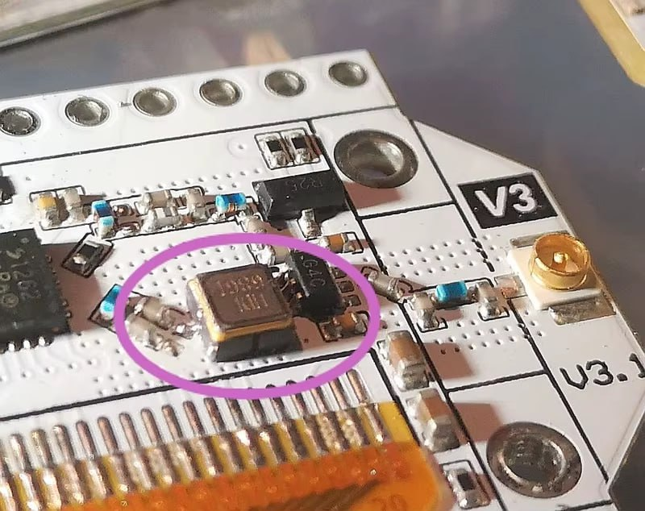
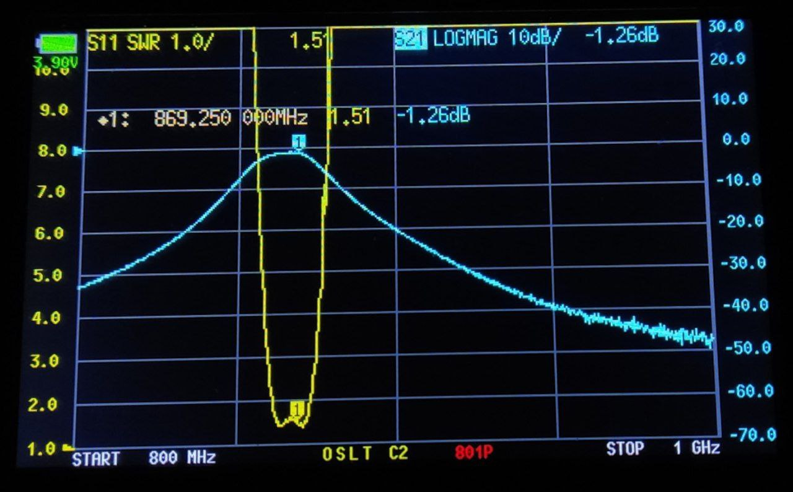
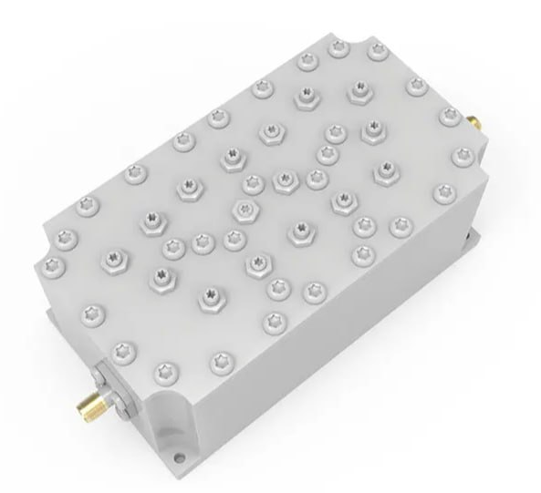
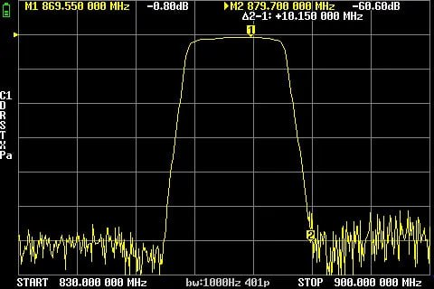

**Проблема:**

Meshtastic работает на частоте 868Мгц, а неподалёку, на частотах 930-960МГц расположены базовые станции сотовой связи с мощностями 500+Ватт, которые вызывают desensitization (не знаю как это слово по-русски) входного тракта SX1262, что приводит к его "оглушению". Особенно этому подвержены платы с LNA/FEM (типа Heltek V4 и модули EByte E22), который усиливает все сигналы, включая помехи. Платы без LNA (типа Heltek V3) менее подвержены данному эффекту, но он всё-равно может проявляться.

**Симптомы:**
- Вас слышно хорошо, а вы вообще не слышите отдаленных нод
- Ближние ноды слышны плохо. Когда вы их трассируете, то они вас слышат хорошо, а вы их плохо, на грани слышимости (например, сильно несимметричный SNR при трассировке: +0,5dB от вас к ним и -17.5dB от них к вам).

**Как проверить:**
Настройте измеритель мощности или спектральный анализатор (популярный TinySA подходит, не забудьте откалибровать его) на диапазон 850-1000МГц, подключите его к антенне и посмотрите на спектр. Если, как на картинке, видны пики выше, чем -30dBm, значит, вероятно, проблема проявится. Также можно просто осмотреться вокруг. Если в прямой видимости есть базовые станции сотовой связи (ночью помечены красными огнями), вероятно, они будут мешать. 

**Мобильные ноды:**
Мобильных нод, скорее всего, это тоже касается. Вы можете стоять под сотовой базовой станцией в 10 метрах от её антенн и ругать Meshtastiс за то, что ничего не принимается и не работает, а проблема может оказаться совершенно не в Meshtastic.

**Решение:**
Установка bandpass фильтра между антенной и платой. Правильно подобранный фильтр подавит помехи и пропустит полезный сигнал.

 

1. **SAW-фильтр**. 
Бюджетный готовый вариант с простой установкой для нетребовательных пользователей. Продаются как в виде SMA-переходника, так и в виде отдельных SMD-чипов. Рекомендуется

**Плюсы:** 
- Дешево
- Прост в установке

**Минусы:**
- Высокие потери сигнала
- Плохо держит высокую мощность

**Ссылки (не забудьте выбрать частоту):**
https://aliexpress.ru/item/1005007918391623.html - SMA вариант для установки после антенны
https://www.ozon.ru/product/868-mgts-dlya-rfid-iot-vydelennogo-polosovogo-filtra-saw-2903553293 - Тоже SMA-вариант
https://aliexpress.ru/item/1005005318548502.html - SMD-вариант для пайки на плату

При установке между антенной и платой потери сигнала происходят как на приеме, так и на передаче. Можно компенсировать увеличением мощности, но не стоит сильно превышать паспортные значения. Обычно эти фильтры держат 20dBm, но это при постоянном сигнале. В случае Meshtastic с его редкими пакетами 22-24 dB будет держать вполне нормально. Также, для плат без LNA/FEM можно установить сам SMD-фильтр прямо на плату в разрыв приёмного тракта, что уберёт влияние на передачу сигнала.

 
 

**2. Керамический фильтр**

**Плюсы:**
- Малые потери
- Держит повышенную мощность (2 Ватта)

**Минусы:**
- Дороже
- Больше по размеру
- Потребует изготовления платы или пайки прямо к своим контактам

**Ссылки:**
https://www.chipdip.ru/product/dbp-868-u-a-30-rf-filter-band-pass-868mhz-2smd-taoglas-8007532622
https://www.avito.ru/moskva/sport_i_otdyh/polosovoy_filtr_433868915_crossfire_elrs_1870088442

Ставится между антенной и платой. В целом, то же самое, что и SAW, но меньшие потери и большая поддерживаемая мощность.

 

3. **Cavity фильтр**

**Плюсы:**
- Минимальные потери
- Держит высокую мощность (10+ Ватт)

**Минусы:**
- Большой размер
- Дорогой

**Ссылки:**
https://aliexpress.ru/item/1005004448323950.html

Вариант для перфекционистов. Не рекомендуется.
 
 