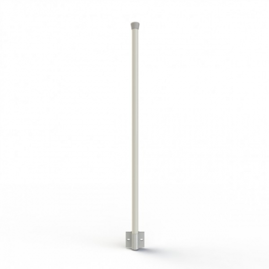
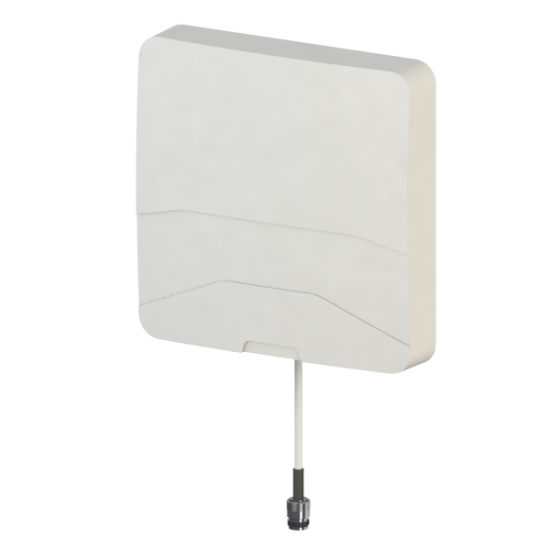
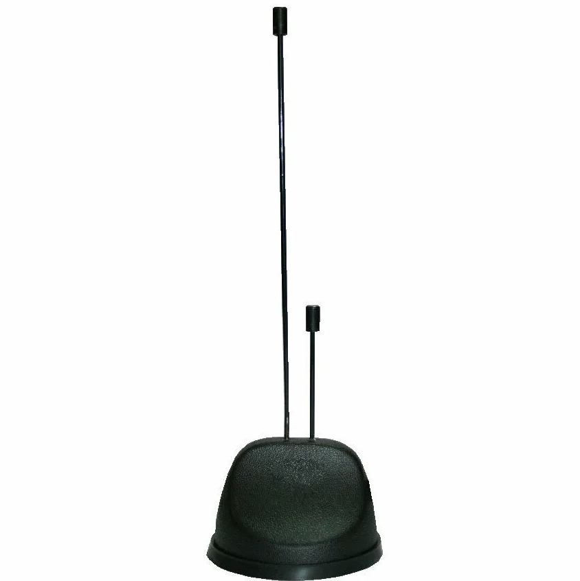
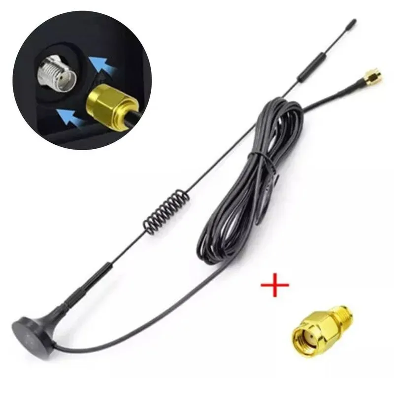

[Главная](README.md) 

# Антенны

Раздел в разработке...

| Антенна | Характеристики | Результаты тестирования |
| ---- | -------------- | ----------------------- |
| Антэкс AX-867R  | 862-872 МГц, усиление 7dBi | Хорошо |
| Антекс AX-868PCR  | 857-877 МГц, усиление до 8.8 dBi, с круговой поляризацией | Норм |
| Triada SOTA МА-890  | 836–900 МГц, Кабель RG-58 3м, усиление 2,3-7,6 dBi | Плохо |
| 3D print MOXON   | 868 МГц, 8 dBi | Норм |
| LoRaWAN Helium RAK HNT  | 868 МГц, 12 dBi | Норм |
| Китайская труба  | 860-930 МГц, 5.8-12 dBi | Хорошо |
| Китайский штырь на пружинке (OZ-SONQ LoRa Miner)  | 868 МГц, 5.8dBi | Плохо |
